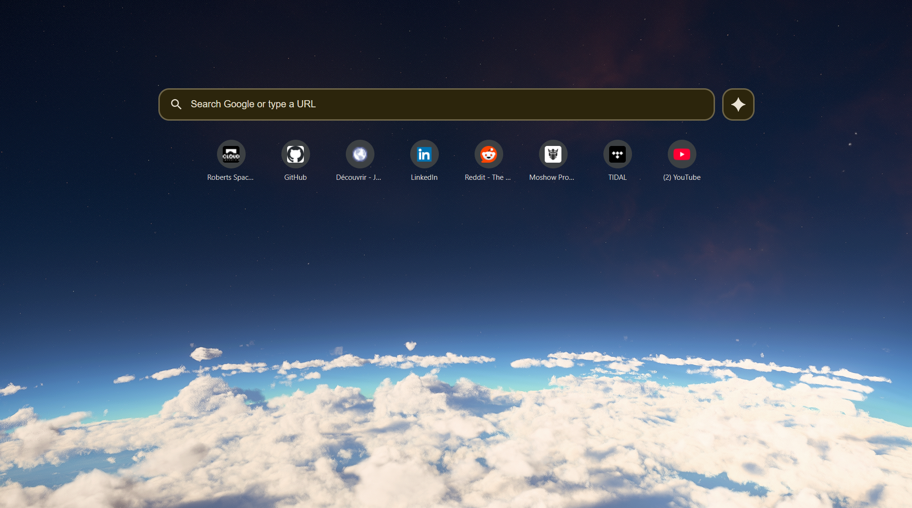

# Custom New Tab Page Extension

This is a browser extension that overrides the default new tab page with a custom, feature-rich start page. It is designed with a dark, clean aesthetic inspired by Chrome's "Citron" theme and features a background from the game Star Citizen.



## Features

*   **Unified Search Bar**: Search Google or type a URL directly. The input field automatically detects whether your query is a search term or a web address.
*   **Dynamic Suggestions**: As you type, a dropdown appears with a combined list of:
    *   **Google Search Suggestions**: Real-time suggestions from Google.
    *   **Browser History**: Matching pages from your browsing history.
    *   **Grouped History**: History items from the same domain are grouped into a single, expandable entry for a cleaner look.
*   **Quick Links**: Displays a grid of your top 8 most visited websites for one-click access.
*   **Gemini Shortcut**: A dedicated button to quickly open Google Gemini in a new tab.
*   **History Management**: You can remove a specific page from your browser history directly from the suggestions list.
*   **Modern & Responsive Design**: A clean, dark theme that is easy on the eyes, with a layout that works well on different screen sizes.

## Tech Stack

*   **Manifest V3**: Built using the latest browser extension platform.
*   **HTML5**: For the page structure.
*   **CSS3**: For all custom styling, including Flexbox, Grid, and custom properties.
*   **JavaScript (ES6+)**: For all interactive logic, including:
    *   Fetching data from `chrome.*` APIs (`topSites`, `history`).
    *   Making `fetch` requests to Google's suggestion endpoint.
    *   DOM manipulation to dynamically render suggestions and links.
    *   Event handling for a responsive user experience.

## Availability

The extension will be added to the Microsoft Edge Add-ons store soon. (hopefully)

## Installation (Manual)

To install and use this extension locally, you need to load it as an unpacked extension in a Chromium-based browser (like Google Chrome or Microsoft Edge).

1.  **Clone or Download**: Clone this repository to your local machine or download it as a ZIP file and extract it.
    ```sh
    git clone https://github.com/Rhynd/NewTab_Extention.git
    ```
2.  **Open Extensions Page**: Open your browser and navigate to the extensions management page:
    *   For Chrome: `chrome://extensions`
    *   For Edge: `edge://extensions`
3.  **Enable Developer Mode**: Find and turn on the "Developer mode" toggle, usually located in the top-right corner of the page.
4.  **Load Unpacked**: Click the "Load unpacked" button that appears.
5.  **Select Folder**: In the file selection dialog, navigate to and select the root folder of this project (the one containing `manifest.json`).

The extension should now be installed. Open a new tab to see it in action!
